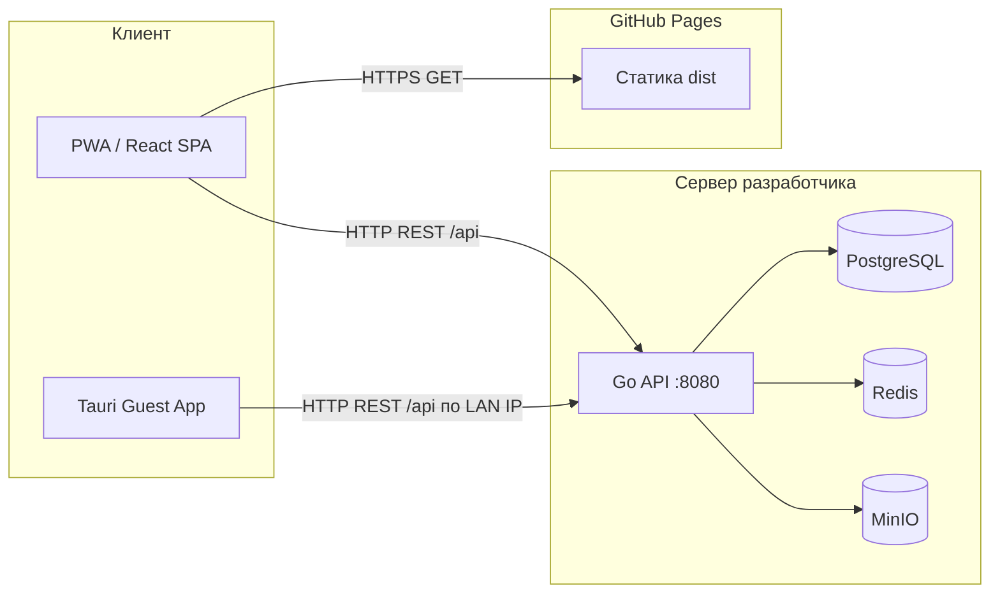
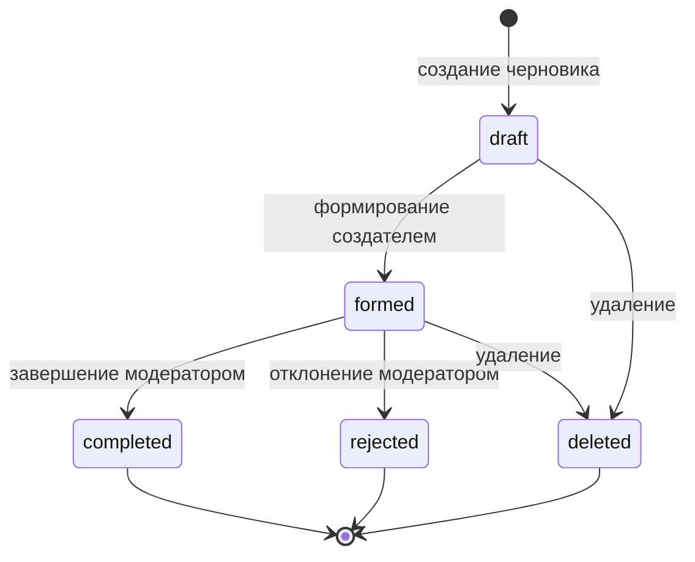
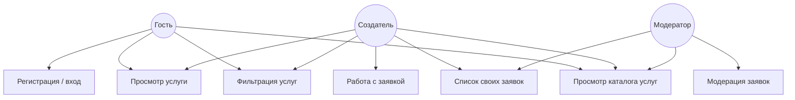

# Диаграммы для лабораторной 8 (вставить в РПЗ как рисунки)

## Deployment-диаграмма

```mermaid
flowchart LR
  subgraph client [Клиент]
    PWA[PWA / React SPA]
    Tauri[Tauri Guest App]
  end

  subgraph pages [GitHub Pages]
    Static[Статика dist]
  end

  subgraph server [Сервер разработчика]
    Go[Go API :8080]
    PG[(PostgreSQL)]
    Redis[(Redis)]
    Minio[(MinIO)]
  end

  PWA -->|HTTPS GET| Static
  PWA -->|HTTP REST /api| Go
  Tauri -->|HTTP REST /api по LAN IP| Go
  Go --> PG
  Go --> Redis
  Go --> Minio
```

## Диаграмма состояний заявки

```mermaid
stateDiagram-v2
  [*] --> draft: создание черновика
  draft --> formed: формирование создателем
  formed --> completed: завершение модератором
  formed --> rejected: отклонение модератором
  draft --> deleted: удаление
  formed --> deleted: удаление
  completed --> [*]
  rejected --> [*]
  deleted --> [*]
```

## Диаграмма прецедентов React-интерфейса

```mermaid
flowchart TB
  Guest((Гость))
  User((Создатель))
  Mod((Модератор))

  Guest --> UC1[Просмотр каталога услуг]
  Guest --> UC2[Фильтрация услуг]
  Guest --> UC3[Просмотр услуги]
  Guest --> UC4[Регистрация / вход]

  User --> UC1
  User --> UC2
  User --> UC3
  User --> UC5[Работа с заявкой]
  User --> UC6[Список своих заявок]

  Mod --> UC1
  Mod --> UC6
  Mod --> UC7[Модерация заявок]
```
